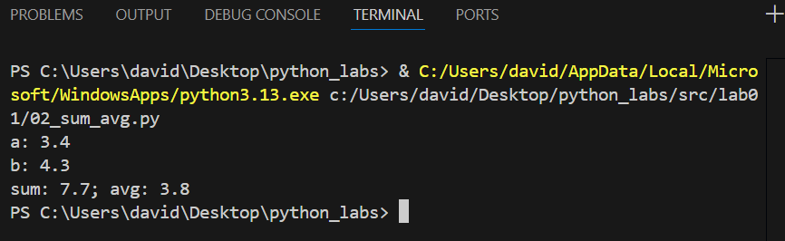
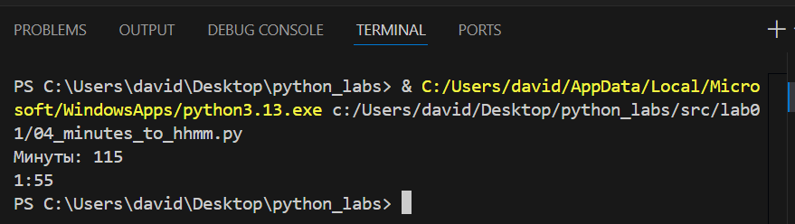
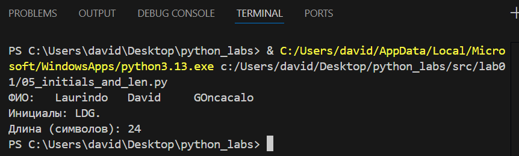

# ЛР1 — Ввод/вывод и форматирование

## Задание 1 — Привет и возраст

## Задание 2 — Сумма и среднее

## Задание 3 — Чек: скидка и НДС

## Задание 4 — Минуты → ЧЧ:ММ

## Задание 5 — Инициалы и длина строки

# ЛР2 — Коллекции и матрицы (list/tuple/set/dict)

## Задачки
### Задание 1 — arrays.py
