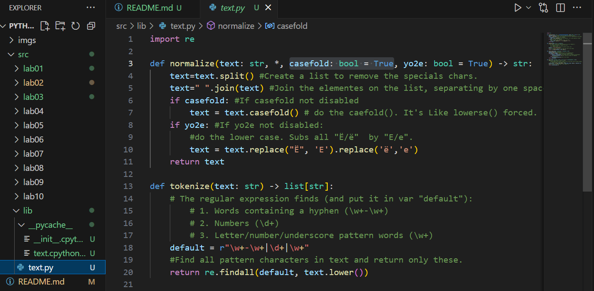
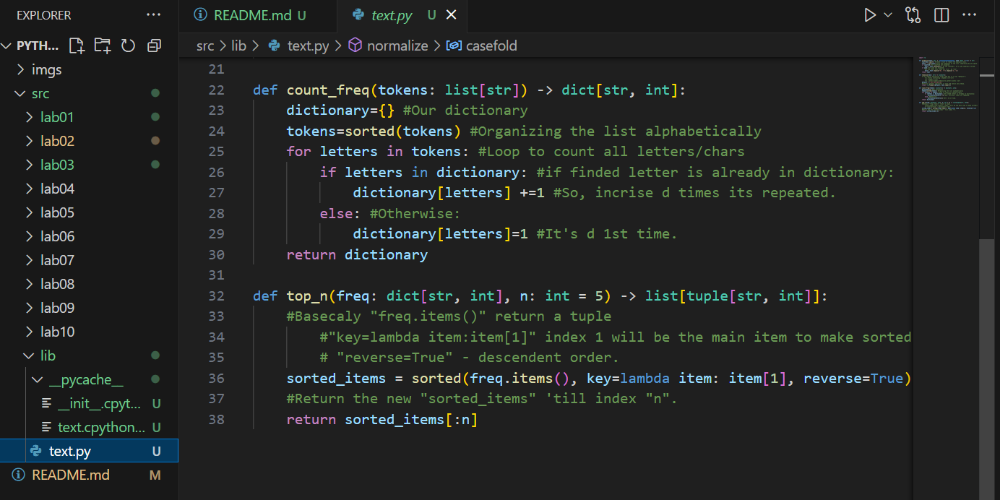
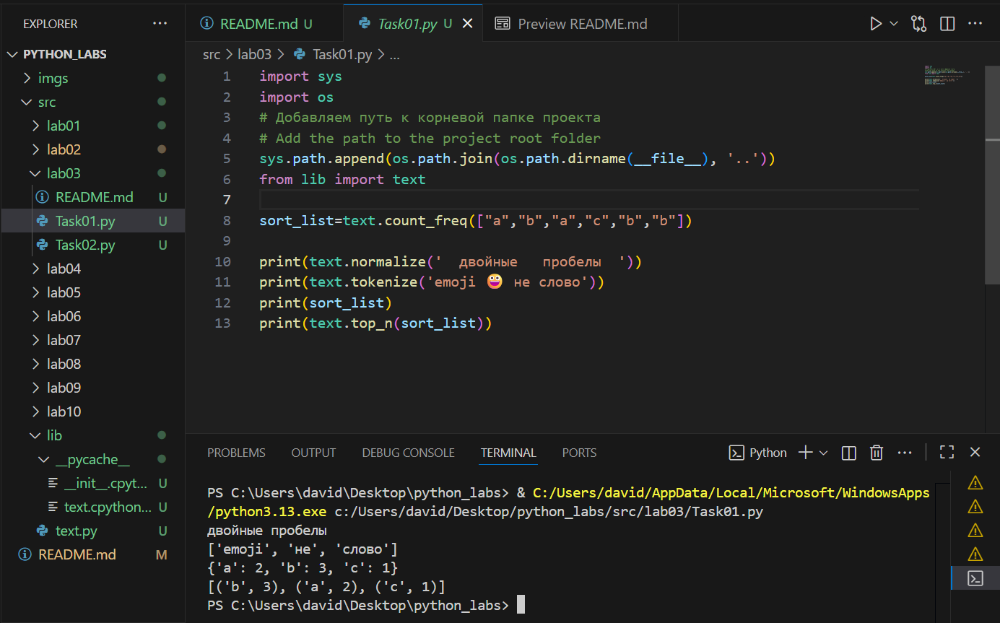
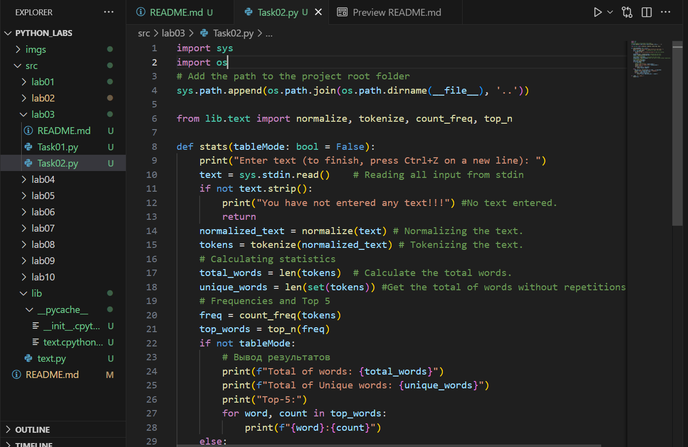
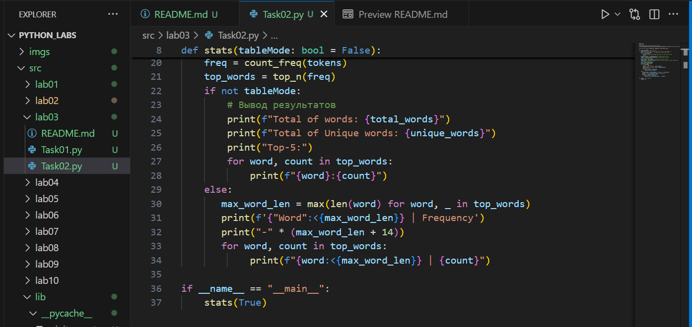
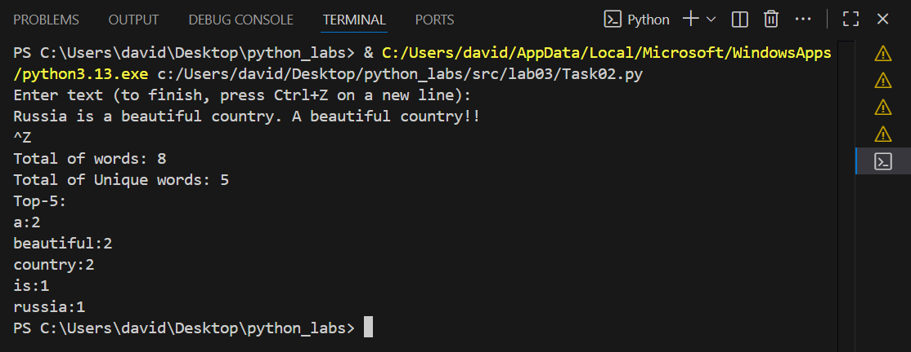
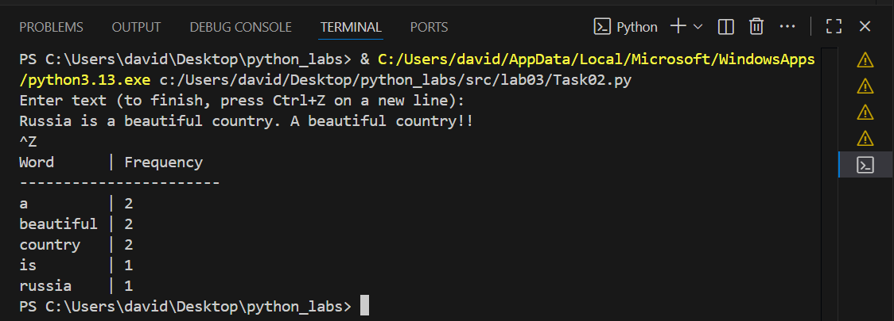

# ЛР3 — Тексты и частоты слов (словарь/множество)

## Задание 1 — normalize, tokenize, count_freq, top_n
## Library: src/lib/text.py

## Executable: src/lab03/Task01.py

## Задание B — src/text_stats.py (скрипт со stdin)
### User enter a text. The flag to finish the text is «ENTER»+ «CTRL+Z»

### By default, Output is not a table. If user whats a table, must call the function *stats(tableMode: bool = False)* like this: stats(True)

### Default output (without table)- stats()

### Output with table - stats(True)
