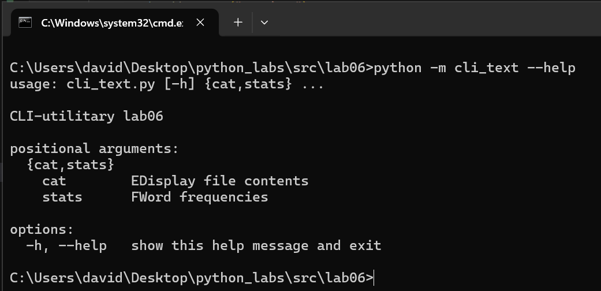
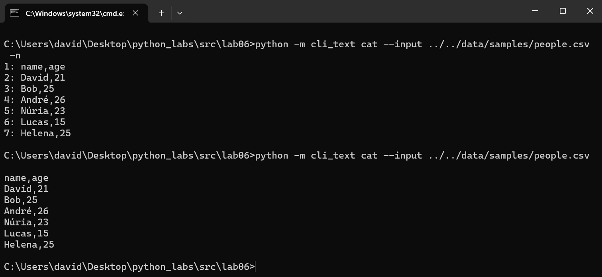
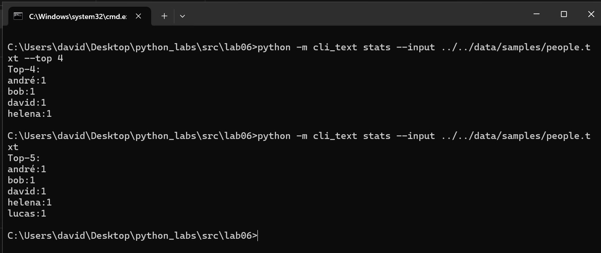
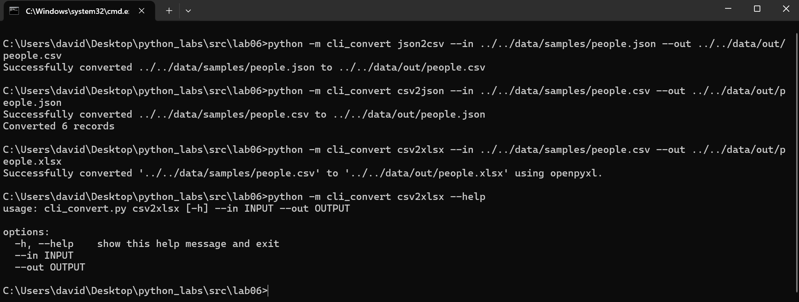
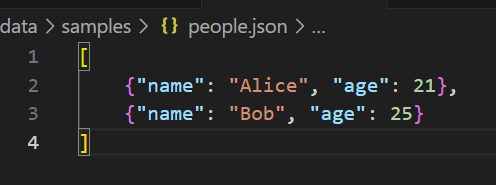
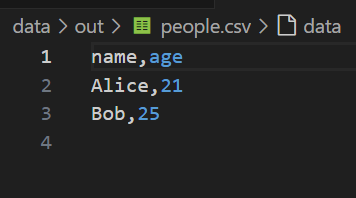
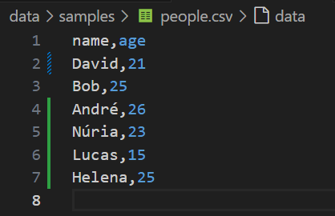
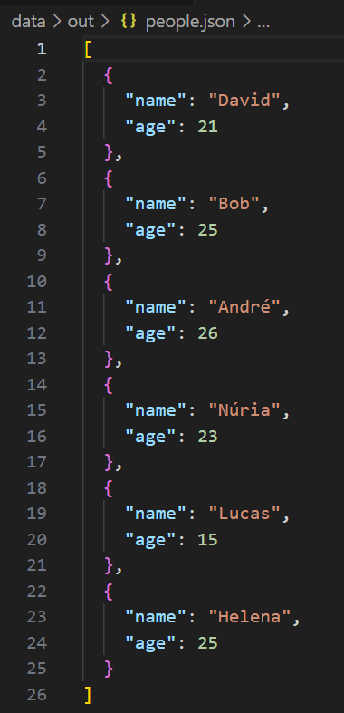
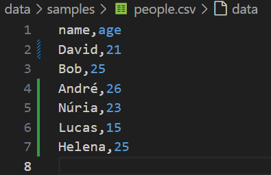
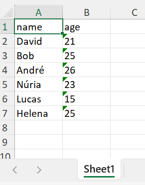

# ЛР6 — CLI‑утилиты с argparse (cat/grep‑lite + конвертеры): Техническое задание

## Задание A — cПодкоманды в одном CLI

## Code

## Help

## Result command cat

## Result command stats

## Задание B — CLI‑конвертер CSV → XLSX

## Code

## All commnands Result JSON ↔ CSV & CSV → XLSX & HELP

## Result JSON → CSV

### Result CSV → JSON

## Result CSV → XLSX

